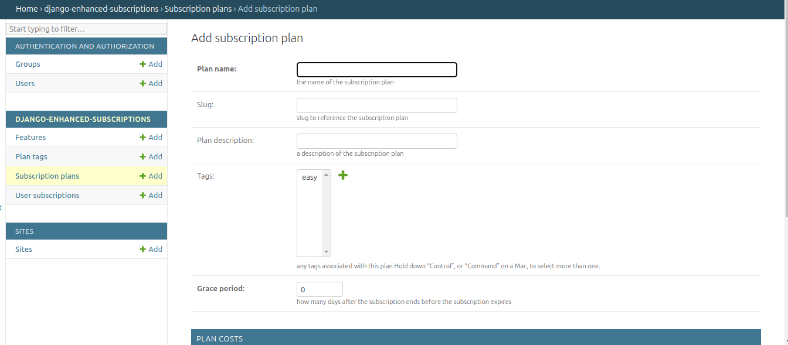
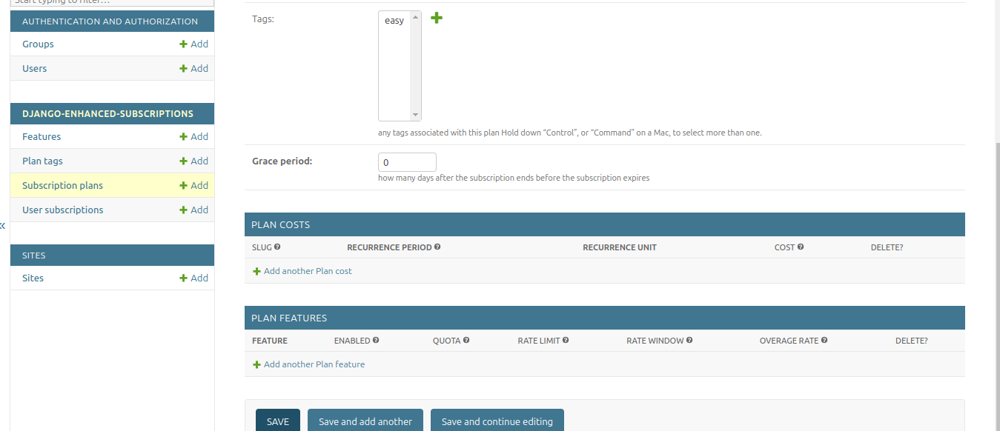
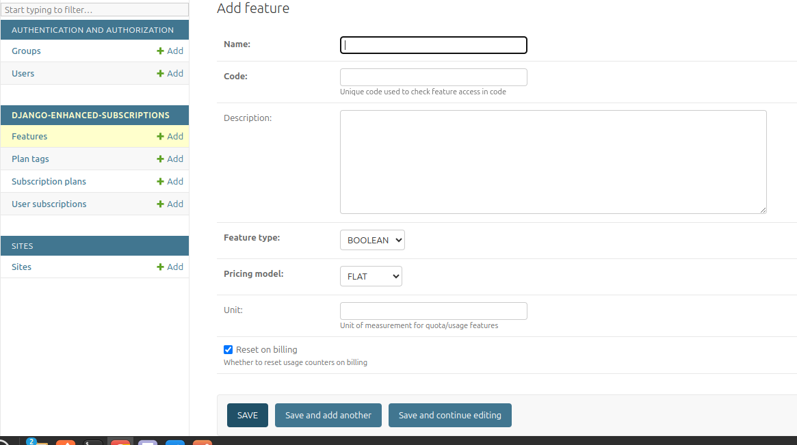

Usage
=====

.. _usage:

1. Set Up Subscription Plans
----------------------------

Creating A Subscription Plan
~~~~~~~~~~~~~~~~~~~~~~~~~~~~
You can use the admin

Or via code

.. code-block:: python

   from subscription.models.plan import SubscriptionPlan, PlanCost, MONTH

   # Create a subscription plan
   plan = SubscriptionPlan.objects.create(
       plan_name="Basic Plan",
       is_feature_based=True,
       grace_period=7  # 7 days grace period
   )

   # Add pricing to the plan
   PlanCost.objects.create(
       plan=plan,
       recurrence_period=1,
       recurrence_unit=MONTH,
       cost=Decimal("10.00")
   )

Subscribing A User
~~~~~~~~~~~~~~~~~~

.. code-block:: python

   from subscription.models.plan import UserSubscription
   from django.utils import timezone

   user_subscription = UserSubscription.objects.create(
       user=user,
       subscription=plan_cost,
       date_billing_start=timezone.now(),
       date_billing_next=timezone.now() + timezone.timedelta(days=30)
   )

2. Setup A User A Wallet
------------------------
Summary
~~~~~~~
+ Manage a user wallet for managing subscription payments, refunds and credits
+ Records all wallet transactions including subscription payments, cancellation and refunds

After setting up plans and subscriptions, the next steps involve funding the user's wallet and managing subscriptions using the PlanManager.
Here's a detailed guide on these processes:

Depositing Funds Into The Wallet
^^^^^^^^^^^^^^^^^^^^^^^^^^^^^^^^

Before a user can pay for subscriptions, they need to have funds in their wallet. Here's how to handle wallet deposits:

.. code-block:: python

   from subscription.models.wallet import Wallet
   from decimal import Decimal

   # Assuming you have a user object
   user_wallet, created = Wallet.objects.get_or_create(user=user)

   # Deposit funds into the wallet
   deposit_amount = Decimal("100.00")
   transaction = user_wallet.deposit(deposit_amount, "Initial deposit")

   print(f"New balance: {user_wallet.balance}")

It's important to ensure that users have sufficient funds in their wallet to cover their subscription costs.

Managing Subscriptions With ``PlanManager``
^^^^^^^^^^^^^^^^^^^^^^^^^^^^^^^^^^^^^^^^^

The PlanManager is responsible for handling new, due and expired subscriptions. 
Here's how to use it:

.. code-block:: python

   from subscription.manager import PlanManager

   plan_manager = PlanManager()

   # Process all subscriptions (new, due, and expired)
   plan_manager.process_subscriptions()

This method will:

1. Activate new subscriptions
2. Renew due subscriptions
3. Handle expired subscriptions

Activating New Subscriptions
^^^^^^^^^^^^^^^^^^^^^^^^^^^^

For new subscriptions:

.. code-block:: python

   new_subscription = UserSubscription.objects.get(id=subscription_id)
   plan_manager.process_new(new_subscription)

This will:

- Attempt to charge the user's wallet for the subscription cost
- If successful, activate the subscription and set the next billing date
- If unsuccessful (e.g., insufficient funds), the subscription remains inactive

Renewing Due Subscriptions
^^^^^^^^^^^^^^^^^^^^^^^^^^

For subscriptions that are due for renewal:

.. code-block:: python

   due_subscription = UserSubscription.objects.get(id=due_subscription_id)
   plan_manager.process_due(due_subscription)

This will:

- Attempt to charge the user's wallet for the renewal cost
- If successful, update the next billing date
- If unsuccessful, it will handle the failed renewal based on the grace period settings

Handling Expired Subscriptions
^^^^^^^^^^^^^^^^^^^^^^^^^^^^^^

For subscriptions that have expired:

.. code-block:: python

   expired_subscription = UserSubscription.objects.get(id=expired_subscription_id)
   plan_manager.process_expired(expired_subscription)

This will:

- Deactivate the subscription
- Handle any necessary clean-up (e.g., resetting feature usage)

Handling Refunds
^^^^^^^^^^^^^^^^

.. code-block:: python

   refund = wallet.process_refund(
       payment_transaction,
       amount=Decimal("5.00"),
       reason=RefundReason.CUSTOMER_REQUEST,
       description="Partial refund"
   )

Automatic Subscription Processing
^^^^^^^^^^^^^^^^^^^^^^^^^^^^^^^^^

In a production environment, you'll want to automatically process subscriptions regularly. This can be achieved using a scheduled task or a management command:

.. code-block:: python

   from django.core.management.base import BaseCommand
   from subscription.manager import PlanManager

   class Command(BaseCommand):
       help = 'Process all subscriptions'

       def handle(self, *args, **options):
           plan_manager = PlanManager()
           plan_manager.process_subscriptions()
           self.stdout.write(self.style.SUCCESS('Successfully processed subscriptions'))

You can then set up a cron job or use a task scheduler like Celery to run this command regularly (e.g., daily).

Handling Failed Payments
^^^^^^^^^^^^^^^^^^^^^^^^

The PlanManager includes logic to handle failed payments:

1. If a payment fails and the plan has a grace period, the subscription remains active until the grace period expires.
2. During the grace period, the system will attempt to process the payment again on subsequent runs of `process_subscriptions()`.
3. If the grace period expires without a successful payment, the subscription will be marked as expired and deactivated.

.. code-block:: python

   # The grace period is defined on the SubscriptionPlan model
   grace_period_days = subscription.subscription.plan.grace_period

   # PlanManager uses this when handling failed renewals
   plan_manager._handle_failed_renewal(subscription)

Monitoring Wallet Balance
^^^^^^^^^^^^^^^^^^^^^^^^^

It's crucial to keep users informed about their wallet balance, especially as it relates to their subscriptions:

.. code-block:: python

   from django.core.mail import send_mail

   def notify_low_balance(user):
       wallet = Wallet.objects.get(user=user)
       if wallet.balance < Decimal("10.00"):
           send_mail(
               'Low Wallet Balance',
               'Your wallet balance is low. Please deposit funds to maintain your subscriptions.',
               'from@example.com',
               [user.email],
               fail_silently=False,
           )

You could run this check after each subscription payment or as part of a regular maintenance task.

3. Add Features To A Subscription Plan
--------------------------------------
Summary
~~~~~~~
+ Define feature that can be included in subscription plans
+ Associates features with subscription plans and define limits
+ Define pricing tiers for features with tiered pricing
+ Tracks usage of features by subscribed users

Creating A Feature
^^^^^^^^^^^^^^^^^^

.. code-block:: python

   from subscription.models.feature import Feature, FeatureType, PricingModel

   feature = Feature.objects.create(
       name="API Calls",
       code="api_calls",
       feature_type=FeatureType.USAGE.value,
       pricing_model=PricingModel.FLAT.value,
       unit="calls"
   )

Adding A Feature To A Plan
^^^^^^^^^^^^^^^^^^^^^^^^^^

Add via admin

OR

.. code-block:: python

   from subscription.models.feature import PlanFeature

   plan_feature = PlanFeature.objects.create(
       plan=subscription_plan,
       feature=feature,
       enabled=True,
       quota=1000,
       overage_rate=Decimal("0.01")
   )

4. Feature Access Control
-------------------------

Using the Feature Checker
~~~~~~~~~~~~~~~~~~~~~~~~~

.. code-block:: python

   from subscription.feature import FeatureChecker

   checker = FeatureChecker(user_subscription)
   access = checker.can_access("api_calls")

   if access.allowed:
       # Proceed with feature access
   else:
       print(access.error)  # "Quota exceeded" or "Feature not available"

Decorator For Feature-based Access Control
~~~~~~~~~~~~~~~~~~~~~~~~~~~~~~~~~~~~~~~~~~

.. code-block:: python

   from subscription.feature import requires_feature
   from django.http import HttpResponse

   @requires_feature("api_calls")
   def api_view(request):
       return HttpResponse("API access granted")

5. Usage-Based Billing
----------------------

.. code-block:: python

   from subscription.feature import UsageBasedBilling

   billing = UsageBasedBilling()
   charges = billing.calculate_charges(user_subscription, "api_calls", 150)

   print(charges["total"])  # Total charge for the usage

6. Subscription Management
--------------------------

Processing Subscriptions
------------------------

.. code-block:: python

   from subscription.manager import PlanManager

   manager = PlanManager()
   manager.process_subscriptions()  # Processes all due subscriptions

Cancelling A Subscription
~~~~~~~~~~~~~~~~~~~~~~~~~

.. code-block:: python

   refund = wallet.process_subscription_cancellation(user_subscription, prorate=True)

Important Notes
~~~~~~~~~~~~~~~

1. The library supports different feature types: Boolean, Quota, Rate-limited, and Usage-based.
2. Pricing models include Flat rate, Tiered, Volume-based, and Package-based billing.
3. The `PlanManager` handles subscription renewals, feature usage resets, and billing.
4. The library includes a caching mechanism for optimized feature access checks.
5. Wallet transactions are recorded for deposits, payments, and refunds.
6. Grace periods can be set for subscriptions to handle failed payments.

